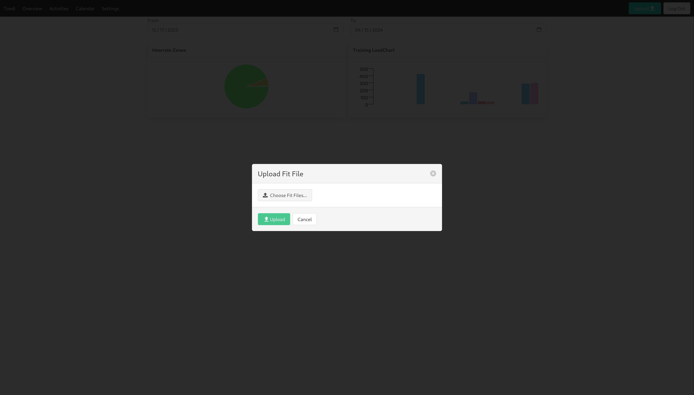
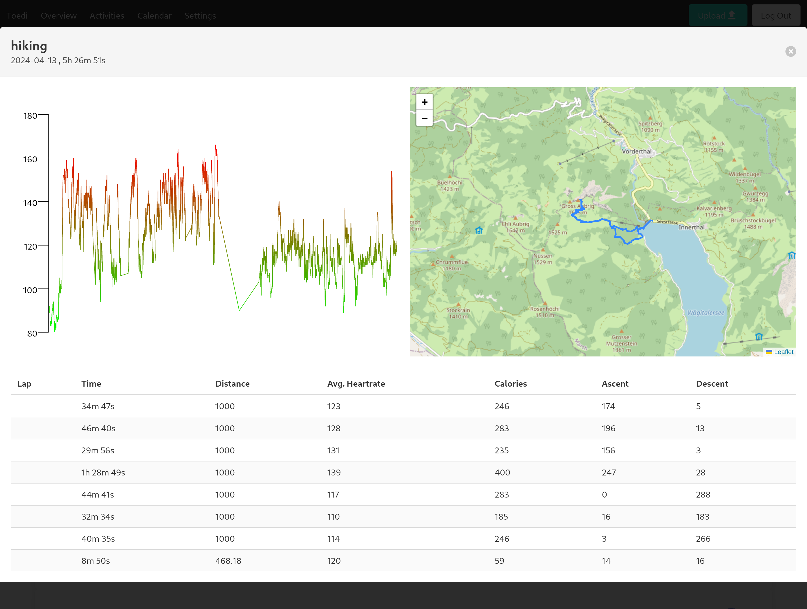
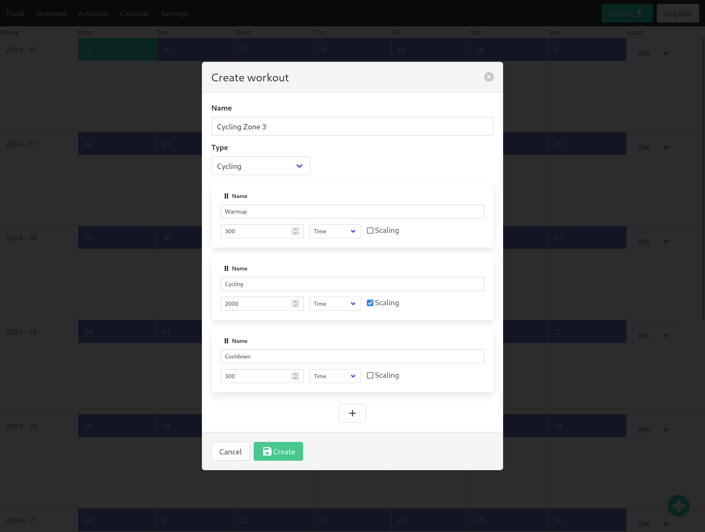
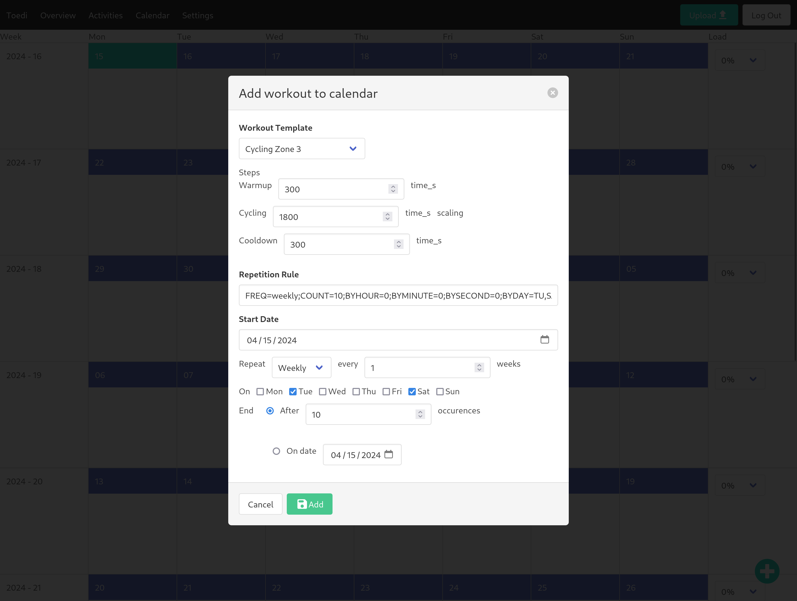
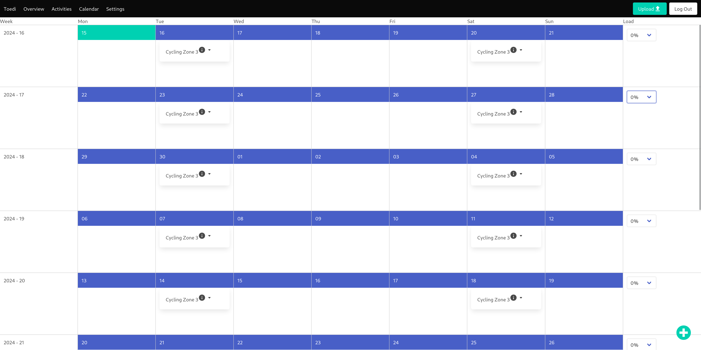

# Usage

## Setting heartrate zones

The first thing you should do when using Toedi is set up your heartrate zones, 
as these are used to calculate training load and other metrics. You can do so 
by clicking `Settings` in the top bar.
Toedi uses a 3 zone model based around aerobic threshold, anaerobic threshold 
and max heartrate. There are many zone models out there, ranging from 3 to 7 or 
even 9 zones. From a scientific standpoint, only the 3 zone model is actually 
based on physiological parameters and subdiviving them into more zones is 
somewhat arbitrary. If you're used to a 5 zone model, it maps to Toedi's model 
roughly like:
- Zones 1 and 2 -> Zone 1
- Zone 3 -> Zone 2
- Zones 4 and 5 -> Zone 3

with the aerobic threshold lying between zone 1 and 2, and the anaerobic 
threshold being between zone 2 and 3.

The best way to assess your aerobic threshold (other than a lab test) is to do 
a [heartrate drift 
test](https://uphillathlete.com/aerobic-training/heart-rate-drift/).
The anaerobic threshold can be determined using [this 
method](https://uphillathlete.com/aerobic-training/diy-anaerobic-test/).
Your max heartrate is, as the name says, the highest heartrate you can get with 
any exercise, HIIT type exercise is well suited to figure this out or just take 
the highest heartrate you ever achieved.
It's recommended to repeat the above tests every couple of months, as they can 
vary due to training and other factors.

If you do not want to do the above tests, a simple (yet inaccurate) way to get 
you started is:
- Aerobic threshold: 60% of max heartrate for untrained individuals, 85% of max 
heartrate for well trained athletes.
  - below this, you can still hold normal conversations while exercising, above 
you can only talk in short bursts
- Anaerobic threshold: around 80-90% of your max heartrate
  - above this you can't talk other than maybe a single word here or there, as 
you're breathing heavily.

## Uploading Fit files

Download workouts from your fitness tracker or the homepage associated with 
your fitness tracker in `*.fit` format.

Simply upload one or more files using the `Upload` button in the top right. The 
workouts should then show up in the `Activites` page, as well as metrics on the 
`Overview` page.

## Metrics

You can see fitness metrics on the overview page. At the moment this shows time 
spent in each of the three heartrate zones, which is useful if you follow 
something like the 80:20 training. 

Additionally you can see your weekly training load, which allows you to keep 
track of your training progression over time. Toedi differs in how it 
calculates training load from other platforms. Where others simply take the 
average heartrate of a workout, assign a weight factor to each zone and then 
multiply the workoout time in minutes with that factor, Toedi has a more 
finegrained approach. It fits an exponential curve to your aerobic and 
anaerobic threshold that mirrors how effort increases with heartrate and then 
multiplies time spent at each heartrate with a weighing factor obtained from 
that curve. 
For instance, in a traditional model, if your zone 1 started at 135 beats and 
your zone 2 started at 148 beats, if you trained for an hour at 147 beats 
average or ot 135 beats, you would get the same load. Conversely, if you 
trained for an hour at 148 beats, the load would be twice that of training at 
147 beats, even though the effort isn't meaningfully different. Since Toedi 
doesn't use zones to calculate load but instead uses raw haertrate data, the 
load should reflect reality much better.

## Activities

On this page, you can see a list of your past workouts. You can delete a 
workout or click its name to see its details, including the heartrate chart and 
a map if the workout was done with GPS, as well as heartrate, calories burned, 
elevation gain/loss etc. for laps in the workout.

## Workout planner

To create a workout plan, you need to first create workout templates for the exercises you would like to do. For this, click on the `+` in the bottom right and select `Add Template`.

Pick a name for the workout, select a workout type and then fill in the different steps of the workout. In the screenshot above, you can see a workout with three steps: a warmup of 5 minutes (300 seconds), then cycling for 2000 seconds followed by a cooldown of 5 minutes (entering times more easily is still left to be implemented). Notice that the `Cycling` part has scaling enabled. This is because we want the warmup and cooldown to always be 5 minutes, so they don't scale, but the Cycling part will automatically be scaled based on your training schedule, which we will define later. You can also change the order of steps by dragging them around.

Once you have a template saved, you can add it to the workout calendar by clicking the `+` in the bottom right again and selecting `Add Workout Entry`.

You can pick which template to add, override the initial setting and pick repetition rules for the workout. In this case, we lowered the time for the `Cycling` step from 2000 to 1800 seconds. We also scheduled this workout to occur a total of 10 times, repeating every week on Tuesdays and Saturdays, starting in the week of 04/15/2024.

After you have saved the workut entry, it will show up in the calendar:

You can delete a workout series or an individual occurence by hovering over the downward arrow. You can see the details of a workout by hovering over the `i` icon. 
Since we do not want to have each of these occurences be exactly the same, but we'd rather like to ramp up the intensity over time, you can set the relative scaling on a weekly basis using the dropdowns on the right. For instance, picking `30%` for the second week would mean that the exercises in that week (and any week after) would be 30% longer than the first week. This only affects the `Cycling` step, as it was the only one for which we enabled scaling. You can set negative percentages as well, for instance for a recovery week when you want to do less total effort.
The scalings can be changed at any time, for example if you feel the increase per week wasn't enough.
